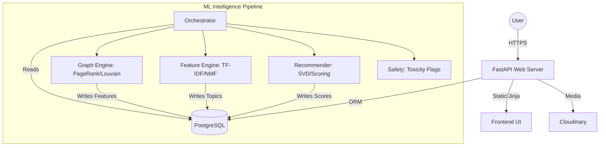

<p align="center">
  
</p>

<h1 align="center">🌆 Strange Street</h1>

<p align="center">
  <strong>The Social Media Intelligence System where Strangers become Connections.</strong>
</p>

<p align="center">
  
  
  
  
  
</p>

---

## 🌟 Overview

**Strange Street** is a production-ready social networking platform that leverages advanced **Machine Learning** and **Graph Theory** to facilitate meaningful connections between strangers. Unlike traditional social media, Strange Street focuses on discovery, progressive identity disclosure, and community-driven engagement.

Built with a high-performance **FastAPI** backend and a sophisticated **ML Intelligence Pipeline**, it provides real-time recommendations, topic discovery, and automated content safety.

## 🚀 Key Features

### 🕵️ Progressive Identity (The "Reveal" System)
Connections start with mystery. Users interact via aliases, and as trust grows through communication, information is revealed in stages:
- **Level 0**: Alias & Avatar only
- **Level 1**: Bio Reveal
- **Level 2**: Photo Reveal
- **Level 3**: Full Identity (Username) Disclosure

### 🧠 ML Intelligence Pipeline
A multi-stage background engine that powers the platform's "brain":
- **Graph Engine**: Computes **PageRank** for user influence and **Louvain Communities** for grouping.
- **Topic Modeling**: Uses **NMF (Non-negative Matrix Factorization)** to extract interests from posts and profile bios.
- **Recommendation Engine**: **SVD-based** scoring for personalized feeds and "People You Should Know."
- **Safety Module**: Real-time toxicity detection and automated flagging to maintain community standards.

### 🏢 Zones & Economy
- **Zones**: Specialized community hubs with unique flairs, custom rules, and dedicated moderator tools.
- **Street Coins**: A virtual currency system for premium features and platform interactions.
- **Stories & Engagement**: Disappearing stories, polls, reactions, and threaded comments.

---

## 🛠️ Technical Stack

- **Backend**: [FastAPI](https://fastapi.tiangolo.com/) (Asynchronous Python)
- **Database**: [PostgreSQL](https://www.postgresql.org/) with [SQLAlchemy](https://www.sqlalchemy.org/) ORM
- **Migrations**: [Alembic](https://alembic.sqlalchemy.org/)
- **Machine Learning**: 
  - `Scikit-learn`: Feature extraction, NMF, SVD
  - `NetworkX`: Graph algorithms (PageRank, FoF)
  - `Sentence-Transformers`: `all-MiniLM-L6-v2` for semantic search
- **Task Scheduling**: Integrated cron jobs for ML pipeline runs
- **Storage**: [Cloudinary](https://cloudinary.com/) for media persistence
- **Frontend**: Jinja2 Templates, Vanilla JS, and modern CSS (Glassmorphism theme)

---

## 📐 Architecture



---

## 🚦 Getting Started

### Prerequisites
- Python 3.11+
- PostgreSQL
- Cloudinary Account (for media uploads)

### Installation

1. **Clone the repository:**
   ```bash
   git clone https://github.com/yourusername/strangestreet.git
   cd strangestreet
   ```

2. **Create a virtual environment:**
   ```bash
   python -m venv venv
   source venv/bin/activate  # On Windows: venv\Scripts\activate
   ```

3. **Install dependencies:**
   ```bash
   pip install -r requirements.txt
   ```

4. **Configure Environment Variables:**
   Copy `.env.example` to `.env` and fill in your credentials.
   ```bash
   cp .env.example .env
   ```

5. **Run Migrations:**
   ```bash
   alembic upgrade head
   ```

### Running the Application

```bash
# Start the FastAPI server
uvicorn main:app --reload
```

---

## 🧠 ML Pipeline Management

The intelligence pipeline can be run manually or via scheduled tasks.

**Run the full pipeline:**
```bash
python ml/run_pipeline.py
```

**Skip safety checks (for faster testing):**
```bash
python ml/run_pipeline.py --skip-safety
```

---

## ☁️ Deployment

This project is optimized for [Render](https://render.com/).

1. Connect your repository to Render.
2. Render will automatically detect `render.yaml` and provision:
   - **Web Service**: The FastAPI application.
   - **Database**: Managed PostgreSQL instance.
3. Configure the environment variables in the Render dashboard.

---

<p align="center">
  Built with ❤️ for the future of social intelligence.
</p>
